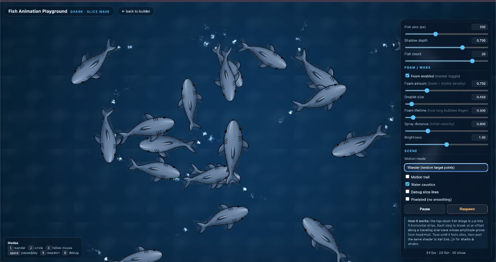

# Marine Life — JS Playground

A zero-dependency, single-file playground that animates **fish, sharks, orcas
and blue whales** swimming around an HTML `<canvas>` from a single top-down
PNG per creature. No spritesheets, no rigs, no shaders — just slice-and-displace.



## Run it

Plain HTML + CSS + JS. **No build step.** The browser does need to fetch the
PNGs from disk, so serve the folder over a static file server:

```bash
# from the repo root
python3 -m http.server 8000
# then open http://localhost:8000
```

…or with Node:

```bash
npx serve .
```

## Controls

| Key       | Action                          |
| --------- | ------------------------------- |
| `1`       | Wander mode (random targets)    |
| `2`       | Circle (smooth loop)            |
| `3`       | Follow cursor                   |
| `space`   | Pause / play                    |
| `R`       | Respawn                         |
| `D`       | Toggle debug slice lines        |

The right-side panel exposes every tweakable parameter live: creature pick,
slice count, tail amplitude, wave frequency, wavelength (in body-lengths),
head stillness, tail emphasis curve, lateral sway, breathe / scale pulse,
bank-into-turn shear, forward speed, turn rate, wave-speed coupling, fish
size, shadow depth, fish count, motion mode, and toggles for motion trails,
tail foam, water caustics and pixelated rendering.

Three quick-start presets are wired to the **Calm**, **Active** and
**Frantic** buttons.

## How it works

Each creature is a single top-down PNG (head pointing down, tail up — see
[`assets/`](assets/)). Every frame the renderer:

1. **Slices the sprite into N horizontal strips** along the body axis.
2. **Displaces each strip horizontally** by `amp(s) * sin(t * 2π * freq − s * 2π / wavelength)`,
   where `s ∈ [0, 1]` runs head→tail. Amplitude is shaped by `s ^ tailExp` so
   the head barely moves and the tail whips.
3. **Adds a small lateral body sway**, a **breathe / scale pulse**, and a
   **shear** that banks the body into the turn direction.
4. **Composites optional effects** — water caustics, tail foam particles, and
   a soft drop shadow — under and over the body.

Because the per-frame work is just `drawImage` strip blits on a cached
canvas, you can run dozens of creatures at 60 fps in a regular browser tab.

> The technique is the **same idea you'd implement as a vertex shader on a
> tessellated quad** (with the displacement done in the vertex stage instead
> of as `drawImage` strips). Ports cleanly to WebGL / WebGPU when you outgrow
> Canvas2D.

## Files

```
index.html                       # the entire playground (HTML + inline JS)
assets/
  fish-topdown.png               # generic small fish
  shark-topdown.png              # shark
  killer-whale-topdown.png       # orca
  blue-whale-topdown.png         # blue whale
```

## Adding more creatures

Drop a top-down PNG in `assets/` (head down, tail up, transparent
background). Then in `index.html`, find the `CREATURES` table (around line
430) and add an entry like:

```js
manta: {
  image: "assets/manta-topdown.png",
  pivot: 0.42,         // 0 = head, 1 = tail — where in the body the rotation pivots
  amp:   0.55,         // tail amplitude relative to body length
  freq:  1.4,          // tail beats per second baseline
  // …other per-creature tuning
},
```

Add a matching `<option value="manta">Manta ray</option>` to the
`<select id="creature">` element and you're done.

## License

MIT — see [`LICENSE`](LICENSE).

## Author

Made by **Ibrahim Boona**.

- X / Twitter: [@boona11](https://x.com/boona11)
- Instagram: [@boona11](https://instagram.com/boona11)
- GitHub: [@boona13](https://github.com/boona13)

Sister project: **[crowds-system-js](https://github.com/boona13/crowds-system-js)**
— the same slice-deformation trick applied to walking pedestrians.
